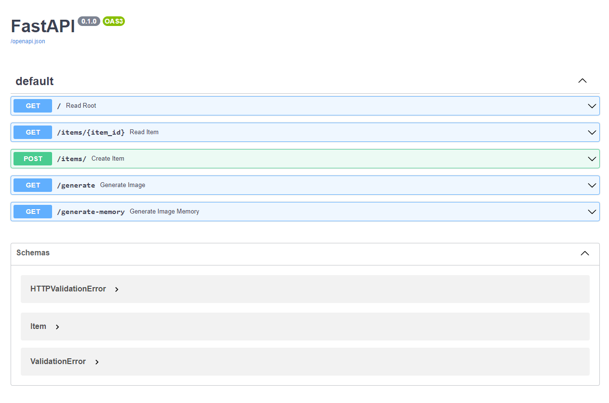
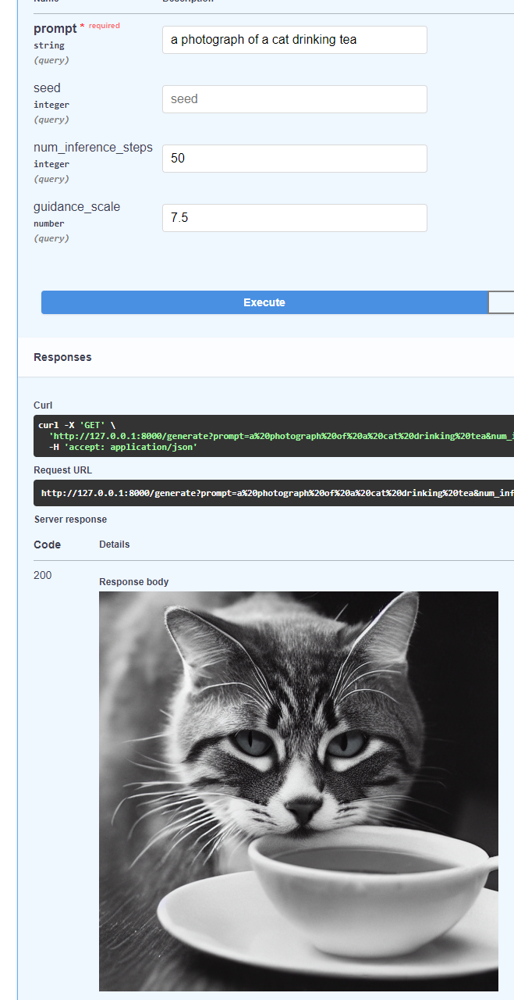

# About this project
This is an implementation of a FastApi application that has various example endpoints

Two generate an image utilizing HuggingFace diffusers and CompVis Stable Difussion v1.4 that take a prompt, a number of inference steps, and a value for the guidance scale

This was my first introduction to FastApi and some of the endpoints are mostly to see how it handles different use cases, the bread and butter was the image generation and was a lot of fun to implement


## Installation requirements

Check your python version
```
py --version
```
created a virtual environment
```
py -m venv env3.11
```
Activate the virutal environment
```
& './env3.11/Scripts/activate.bat'
```
Make sure that it is actually activated when you see the following in VSCode, my environment is env3.11 but it is whatever you named it above


The name of the environment that you gave after venv in the 2nd step ('env3.11') should be presceding the terminal path

Upgrade pip
```
py -m pip install --upgrade pip
```
Install requirements


Dev requirements (dev-requirements.txt)

mypy

ruff

black

ipykernel

```
pip install -r dev-requirements.txt
```

Regular Requirements (requirements.txt)

fastapi[all]

diffusers==0.14.0

transformers

scipy

ftfy

```
pip install -r requirements.txt
```

## Running the main app
Start up the localhost with the below command 
```
uvicorn main:app
```

For development and reloading when file contents change use the below command
```
uvicorn main:app --reload
```
>**WARNING**: If you reload this and update the main.py, every time you save (especially if you have autosave enabled) the downside is that the line **from ml import obtain_image** will load the CompVis Stable Difussion model from the ml.py and it is pretty big, so remember to stop and edit that file or just run it without hte --reload parameter

## Generate an image!
Going to /docs/ will bring up the Swagger page that you can interact with the different api endpoints



You can utilize the generate endpoint to give it a prompt, 
seed (to get back the same image every time), 
number of inference steps, 
and guidance scale values 

For example, the generate method will generate an image from a prompt and utilize the default values of 50 for num_inference_steps and 7.5 for guidance_scale and it saves the file and returns it via a FileResponse



A more ideal api endpoint method is using memory streams

The Generate Memory method utilizes StreamingResponse with a memory stream and won't have to utilize read and writing from disk

