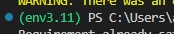

Commands to get this working

Check your python version
py --version

created a virtual environment
py -m venv env3.11

Activate the virutal environment
& './env3.11/Scripts/activate.bat'

Make sure that it is actually activated when you see the following in VSCode

The name of the environment that you gave after venv in the 2nd step ('env3.11') should be presceding the terminal path

Upgrade pip
py -m pip install --upgrade pip

Install requirements

Dev requirements (dev-requirements.txt)
mypy
ruff
black
ipykernel

pip install -r dev-requirements.txt

Regular Requirements (requirements.txt)
fastapi[all]
diffusers==0.8.0
transformers
scipy
ftfy

pip install -r requirements.txt